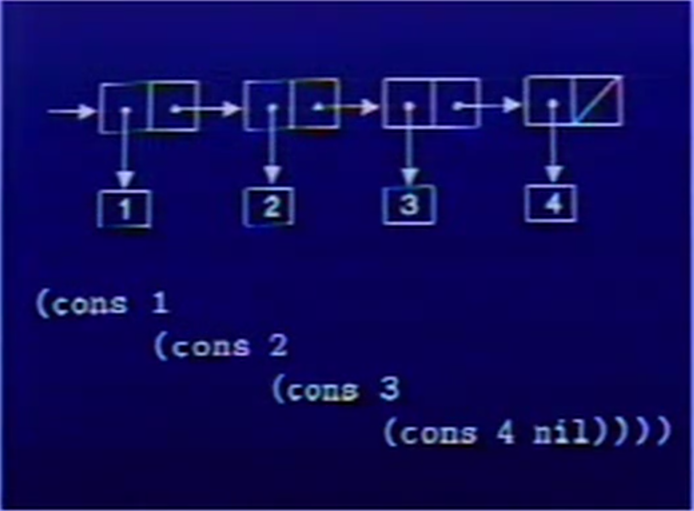

## time:2017.7.1
## SICP：第三章
____
## car cdr
1.   

2. **nil表示结尾**  

---
## list
**一个很大的坑，mit-scheme没有nil，要用'()代替**
1. (list 1 2 3 4) 构建上面的那个图
## 例子
`(define 1-TO-4 (list 1 2 3 4))`
2. 返回（10 20 30 40)  
```scheme
  (define (scale-list s l)
    (if(null? l)
      nil
      (cons ((* (car l) s)
      (scale-list s (cdr l))))))
```

*list怎么得到2？*  
---
## map

map过程的格式如下：

    (map procedure list1 list2 ...)
`procedure` 是个与某个过程或lambda表达式相绑定的符号。作为参数的表的个数视 `procedure` 需要的参数而定。

例：

    ; Adding each item of '(1 2 3) and '(4 5 6).
    (map + '(1 2 3) '(4 5 6))
    ;⇒  (5 7 9)

    ; Squaring each item of '(1 2 3)
    (map (lambda (x) (* x x)) '(1 2 3))
    ;⇒  (1 4 9)
---
## for-each

`for-each` 的格式与`map`一致。但`for-each`并不返回一个具体的值，只是用于副作用。

例：

    (define sum 0)
    (for-each (lambda (x) (set! sum (+ sum x))) '(1 2 3 4))
    sum
    ;⇒  10


# 思想？？完全是在学scheme语言！
